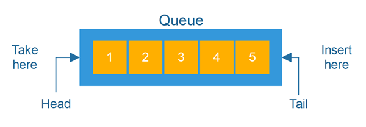
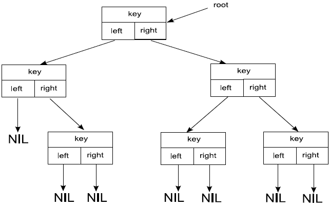

# 21. Listy i drzewa oraz ich zastosowania. Stosy i kolejki

---
## Lista

Lista to ciąg elementów, gdzie każdy zawiera atrybuty: **key**, **next** oraz **previous**. Wartość każdego z tych elementów odczytujemy przez **key[x]**. 

Listy reprezentujemy poprzez obiekt, zawierający atrybuty **head** oraz **tail**, wskazujące odpowiednio na początek i koniec listy.
Listy dzielimy na 3 typy:

- listy jednokierunkowe:
W liście jednokierunkowej każdy z elementów wskazuje na element następny, czyli dla każdego x, **next[x] wskazuje na kolejny**. Ostatni element listy wskazuje na
pusty element NIL.

-  Listy dwukierunkowe:
W liście dwukierunkowej każdy element zawiera trzy atrybuty. Oprócz atrybutu **next** zawiera także **previous** wskazujący na poprzedni element listy. Na pusty
element NIL wskazuje zarówno pierwszy jak i ostatni element listy.

-  Listy cykliczne:
Listą cykliczną nazywamy listę, w której ostatni element zamiast wskazywać na pusty element NIL, wskazuje na pierwszy element listy. **Nie występują tutaj atrybuty head i tail.**

---

## Stos
Stos to liniowa struktura danych, gdzie elementy przetwarzane są w kolejności od tego, który pojawił się **najpóźniej** (jest na górze stosu) do tego, który pojawił się na samym **początku** (na dole stosu).

Poszczególne elementy można przeglądać, lecz by pobrać element znajdujący się poniżej, trzeba pobrać ze stosu wszystkie elementy znajdujące się nad nim.

W algorytmach stos reprezentowany jest przez strukturę **LIFO** (Last In First Out).

---

## Kolejka
Kolejka jest strukturą działającą **przeciwnie do stosu**. Dane są przetwarzane w kolejności ich pojawienia się, tzn.: zaczynając od tego, który pojawił się na
**początku**, kończąc na tym, który znalazł się na **samym końcu**.

W algorytmach kolejka reprezentowana jest poprzez strukturę **FIFO** (First In First Out).

---

## Drzewa

Drzewo składa się z elementów , które posiadają trzy atrybuty: **key**, **left** oraz **right**.
Drzewo reprezentowane jest przez obiekt z atrybutem **root** (korzeń). Kolejne elementy są jego **potomkami**.

W informatyce drzewo wykorzystywane jest do budowy drzew decyzyjnych, które są podstawą działania takich algorytmów jak min-max (wyznaczanie optymalnych ruchów).