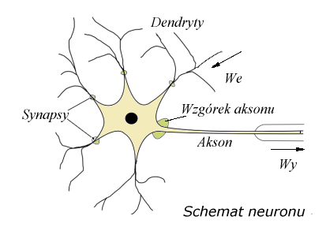
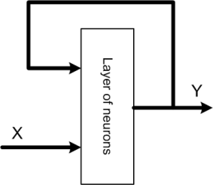
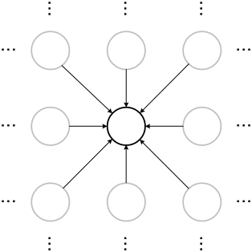

# 39. Sieci neuronowe w sztucznej inteligencji. Rodzaje i zastosowanie

---

Sieci neuronowe to rodzaj sztucznej inteligencji, który naśladuje działanie ludzkiego mózgu w celu uczenia się i podejmowania decyzji. Są one zainspirowane budową biologicznych sieci neuronowych, które składają się z neuronów połączonych synapsami.

Podstawową jednostką budulcową sztucznej sieci neuronowej jest perceptron, czyli uproszczony model neuronu. Perceptron przyjmuje jeden lub więcej sygnałów wejściowych, sumuje je (często z ważeniem), a następnie przekształca przy użyciu funkcji aktywacji. Wartość wyjściowa perceptronu jest następnie przesyłana do innych neuronów.

Sieci neuronowe składają się z warstw neuronów:
1. Warstwa wejściowa: przyjmuje sygnały wejściowe.
2. Warstwy ukryte: przetwarzają sygnały. Może być ich wiele.
3. Warstwa wyjściowa: produkuje wynik działania sieci.

Proces uczenia sieci neuronowej polega na dostosowywaniu wag połączeń między neuronami w taki sposób, aby dla danego zestawu danych wejściowych sieć generowała poprawne dane wyjściowe. Jest to zazwyczaj realizowane za pomocą algorytmu zwrotnego rozprzestrzeniania błędu (backpropagation), który minimalizuje błąd między prognozowanym wynikiem a rzeczywistym wynikiem.

---

### Funkcja aktywacji

Funkcja aktywacji w sieci neuronowej pełni kluczową rolę, umożliwiając modelowi uczenie się złożonych wzorców i rozwiązywanie nieliniowych problemów. Bez funkcji aktywacji każda warstwa sieci neuronowej byłaby w zasadzie liniowym transformator, co ograniczałoby moc obliczeniową całej sieci do jednej warstwy, bez względu na to, ile warstw faktycznie posiada.

**Definicja**
Funkcja aktywacji to matematyczna operacja stosowana do wyjścia neuronu, wprowadzająca nieliniowość do modelu. Działa na poziomie pojedynczego neuronu, przyjmując sumę ważoną jej wejść oraz bias (stałą), a następnie generując wartość wyjściową, która jest przekazywana do następnej warstwy.

**Cel**
Celem funkcji aktywacji jest:

Wprowadzenie Nieliniowości: Sieci neuronowe mają moc modelowania złożonych, nieliniowych wzorców dzięki nieliniowym funkcjom aktywacji.
Transformacja Wejścia: Przekształcenie wejścia neuronu w wartość wyjściową, której zakres zależy od rodzaju funkcji aktywacji.
Ułatwienie Uczenia: Pomoc w procesie uczenia przez umożliwienie aktualizacji wag w oparciu o gradienty.

---

### Rodzeje sieci neuronowych:

Rodzaj sieci neuronowej zależy od sposobu połączenia neuronów tej sieci oraz od kierunku przepływu sygnałów w sieci. Każdy typ sieci ma własne metody doboru wag, czyli uczenia. Istnieje bardzo wiele rodzajów sieci neuronowych jednak najbardziej podstawowe, obrazujące budowę i sposób działania to:

- sieci jednokierunkowe
  - jednowarstwowe
  - wielowarstwowe
- sieci rekurencyjne
- sieci komórkowe

**Sieci jednokierunkowe** których typowym przykładem jest perceptron jednowarstwowy (rys. perceptronu) składają się z neuronów ułożonych w warstwach o jednym kierunku przepływu sygnałów i połączeniach międzywarstwowych jedynie między kolejnymi warstwami. Sieć tego typu posiada warstwę wejściową, wyjściową i warstwy ukryte. Z funkcjonalnego punktu widzenia układ taki można traktować jako układ aproksymacji funkcji nieliniowej wielu zmiennych y = f(u)

**Sieci rekurencyjne** W sieciach tego typu występuje przynajmniej jedno sprzężenie zwrotne. Oznacza to, że sygnały wyjściowe warstwy podawane są na jej wejścia, co powoduje pewną dynamikę w pracy sieci. Sygnały wejściowe w takiej sieci zależą zarówno od aktualnego stanu wejścia jak i od sygnałów wyjściowych w poprzednim cyklu. Strukturę ogólną takiej sieci przedstawia poniższy rysunek.

**Sieci komórkowe** W tych sieciach sprzężenia wzajemne między elementami przetwarzającymi dotyczą jedynie najbliższego sąsiedztwa. Połączenia te są w ogólności nieliniowe i opisane poprzez układ równań różniczkowych. Podstawową trudność w stosowaniu tego typu sieci stanowi opracowanie skutecznej, efektywnej i uniwersalnej metody projektowania. Typowym przykładem sieci komórkowej może być sieć typu mapa Kohonena.

---

### Zastosowanie

### 1. Rozpoznawanie Obrazów
- **Medycyna**: Analiza obrazów medycznych w celu wykrywania chorób, na przykład na zdjęciach rentgenowskich lub rezonansie magnetycznym.
- **Automatyka**: Wizja komputerowa w robotyce, na przykład do identyfikacji i manipulacji obiektami.
- **Bezpieczeństwo**: Systemy rozpoznawania twarzy w celach bezpieczeństwa i nadzoru.

### 2. Przetwarzanie Języka Naturalnego (NLP)
- **Tłumaczenie maszynowe**: Automatyczne tłumaczenie tekstów między różnymi językami.
- **Asystenci głosowi**: Siri, Alexa, Google Assistant – zrozumienie i reagowanie na komendy głosowe.
- **Analiza tekstu**: Wykrywanie sentymentu, klasyfikacja dokumentów, wyodrębnianie informacji.

### 3. Gry Komputerowe i Rozrywka
- **AI w grach**: Tworzenie inteligentnych przeciwników i adaptacyjnych środowisk gry.
- **Generowanie treści**: Automatyczne tworzenie poziomów, tekstur i elementów świata gry.

### 4. Autonomiczne Pojazdy
- **Samochody autonomiczne**: Rozpoznawanie otoczenia, przewidywanie ruchu innych uczestników ruchu, podejmowanie decyzji o kierowaniu pojazdem.

### 5. Finanse i Biznes
- **Prognozowanie giełdowe**: Analiza trendów rynkowych, przewidywanie zmian kursów akcji.
- **Zarządzanie relacjami z klientami (CRM)**: Personalizacja ofert i rekomendacji produktów dla klientów.

### 6. Medycyna
- **Diagnoza chorób**: Analiza danych medycznych w celu wspomagania diagnozy.
- **Personalizowana medycyna**: Dopasowywanie terapii do indywidualnych cech pacjenta.

### 7. Nauka i Badania
- **Analiza danych**: Przetwarzanie i analiza ogromnych zbiorów danych naukowych.
- **Symulacje komputerowe**: Modelowanie zjawisk fizycznych, chemicznych czy biologicznych.

### 8. Sztuka i Twórczość
- **Generowanie muzyki i obrazów**: Tworzenie artystycznych dzieł za pomocą algorytmów.
- **Edycja zdjęć i wideo**: Automatyczna korekcja kolorów, usprawnianie jakości obrazu.

### 9. Ochrona Środowiska
- **Monitorowanie i analiza danych środowiskowych**: Wykrywanie i przewidywanie zanieczyszczeń, zmian klimatycznych.

### 10. E-commerce
- **Rekomendacje produktów**: Personalizowanie wyświetlanych produktów na podstawie historii przeglądania i zakupów użytkownika.

### 11. Produkcja i Przemysł
- **Kontrola jakości**: Automatyczne wykrywanie wad produkcji.
- **Optymalizacja procesów produkcyjnych**: Zwiększanie efektywności i minimalizowanie kosztów.